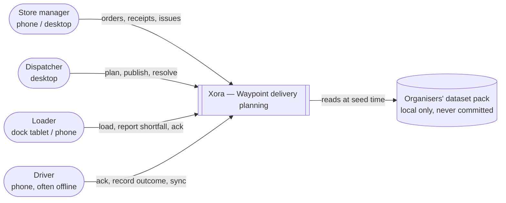
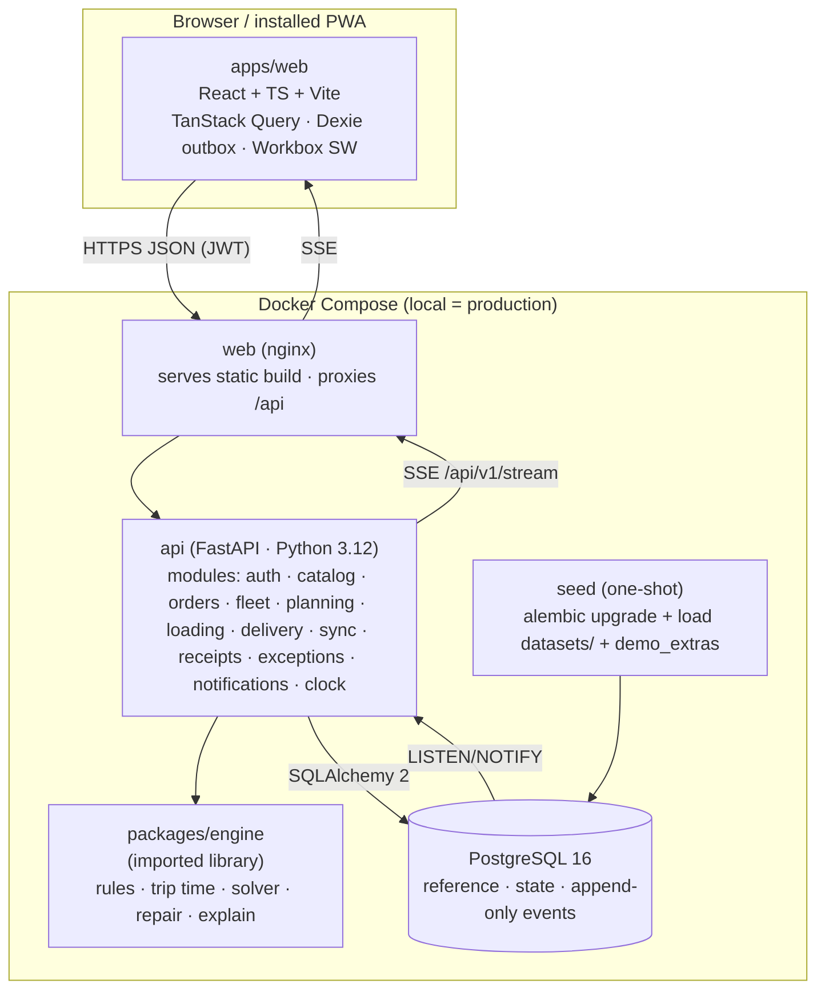
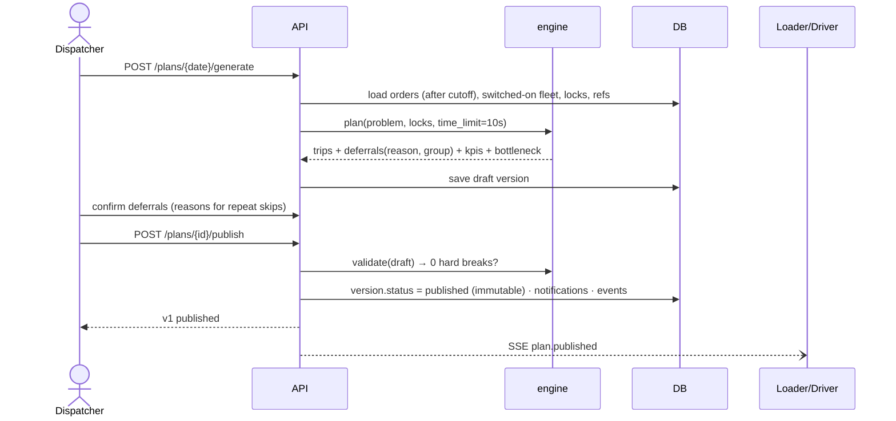
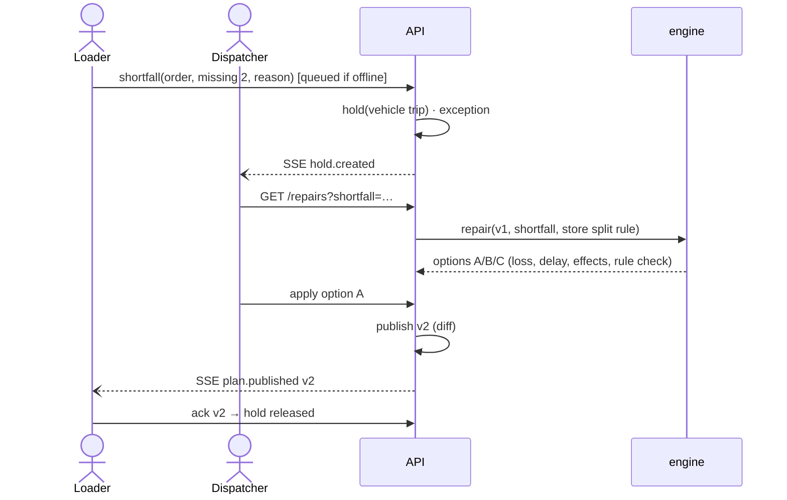
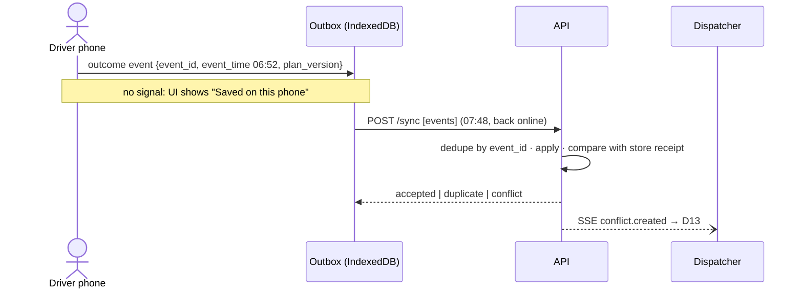

# 03 · Architecture

**Style:** a modular monolith. One FastAPI service with strict internal modules, one React PWA and one PostgreSQL database. The planning engine is a **pure Python package** with no web or database dependencies.
Decisions: [ADR-0001](adr/0001-modular-monolith.md) · [ADR-0002](adr/0002-stack.md) · [ADR-0003](adr/0003-event-log-and-plan-versions.md) · [ADR-0004](adr/0004-offline-first-pwa.md) · [ADR-0005](adr/0005-engine-as-library.md) · [ADR-0006](adr/0006-demo-clock.md) · [ADR-0007](adr/0007-data-confidentiality.md)

## C4 · Level 1 — System context

## C4 · Level 2 — Containers

## Backend modules (`services/api/app/modules/<name>/`)
Each module has `router.py` (HTTP) → `service.py` (use cases, transactions) → `repository.py` (SQL) → `models.py` (ORM) + `schemas.py` (Pydantic). **Modules call each other only through `service.py`**, never through another module's repository.

| Module | Owns | Key use cases |
|---|---|---|
| `auth` | users, roles, scopes | login, `me`, JWT issue/verify, role guards |
| `catalog` | depots, districts, outlets, outlet profiles, vehicles, calendar, service allowance (reference data) | read-only lookups |
| `orders` | orders, order lines | place order (cutoff BR-40, sanity BR-42), list, next delivery |
| `fleet` | daily vehicle status, switch-off reasons, fuel ledger | list fleet for a date, switch on/off (BR-10) |
| `planning` | plans, versions, trips, stops, deferrals, locks, acks | generate (engine), validate edit, lock, confirm deferrals, publish gate, publish |
| `loading` | holds, shortfall reports, load checks | dock trips, load list (reverse order), report shortfall → hold, ack → release |
| `repair` | repair options | compute options (engine), apply → new version |
| `delivery` | stop and order projections | trip view, arrive, outcome (via sync) |
| `sync` | events (append-only), conflicts | `POST /sync` batch, idempotent apply, conflict detection |
| `receipts` | receipts, issues, resolutions | confirm receipt, report issue, resolve (D10), reconcile counts (D13) |
| `exceptions` | exception inbox | rank by impact, suggested fixes |
| `notifications` | notifications | deferral and ETA notices (si/ta/en templates) |
| `clock` | demo clock | get/set the operating time (dispatcher only) |
| `stream` | SSE | fan out domain events to subscribed clients |

## Key flows
### 1. Generate → publish a plan

### 2. Shortfall → repair → v2 → acknowledge

### 3. Offline delivery → sync → conflict

## Cross-cutting
| Concern | Approach |
|---|---|
| **Auth** | Email + password (bcrypt) → JWT access token (HS256, 12 h, carries role + scope ids). Role guards per route; scope checks in services (BR-55) |
| **Validation** | Pydantic v2 at the edges; domain rules in the engine; DB constraints (FKs, CHECKs, unique `event_id`) as the last line |
| **Errors** | RFC 7807 problem+json: `{type, title, status, detail, code, rule_id?}` |
| **Time** | `Clock` dependency: `now()` returns demo time when set (BR-56). All timestamps are `timestamptz`, displayed in Asia/Colombo |
| **Realtime** | SSE `GET /api/v1/stream` (per-user filtered); fed by Postgres `LISTEN/NOTIFY` |
| **Idempotency** | Client `event_id` UUID unique in `events`; `Idempotency-Key` header supported on POSTs |
| **Config** | 12-factor: everything from env (`.env.example`); no secrets in the repo |
| **Logging** | Structured JSON logs (structlog) with `request_id`, user, role; solver time and status logged per plan |
| **Health** | `/health` (liveness) and `/ready` (DB reachable, migrations at head) |
| **Security** | CORS locked to the web origin; rate limit on login; passwords hashed; least-privilege DB user; no PII beyond demo names |
| **Accessibility** | 48 px+ targets (56 px primary on field screens); text labels on every status; contrast AA |

## Quality attributes → tactics
| Attribute | Tactic |
|---|---|
| **Correctness** | One engine for all rule checks; property-based tests; the organisers' `check_allocation.py` run in CI on engine output (when the dataset is available) |
| **Reliability (offline)** | Outbox + retry + idempotent sync; event time vs received time; conflicts never overwrite |
| **Auditability** | Append-only `events`; immutable plan versions; who/when/why on every decision |
| **Maintainability** | Module boundaries; typed contract (OpenAPI → TS client); ADRs; rule IDs in code |
| **Performance** | Plan solve ≤ 10 s (CP-SAT time limit, greedy warm start); API p95 < 200 ms at our scale |
| **Deployability** | Identical `docker compose` locally and in production; seed is idempotent |

## Scale and growth
- **Today:** ~140 orders/day, ~200 users, 1–2k events/day. A single small VM is ample, and Postgres is nowhere near its limits.
- **10× growth** (1,200 outlets, ~1,400 orders/day): the same design holds. Per-depot solves are already independent; split further by brand × district, which BR-01 makes natural. Move solves to a worker queue (the interface is already async-ready).
- **Not needed at this scale (deliberately avoided):** microservices, Kafka, Kubernetes, Redis. Each adds failure modes without solving a real problem here.
