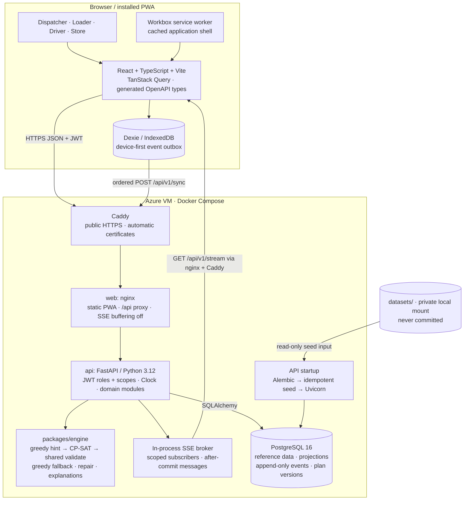

# 03 · Architecture

Xora is a modular monolith: a React PWA, one FastAPI service and PostgreSQL 16.
The engine is an imported Python library using OR-Tools CP-SAT; it has no web,
database or filesystem dependencies. This describes the merged implementation,
not the original target module map.

Decisions: [ADR-0001](adr/0001-modular-monolith.md),
[ADR-0002](adr/0002-stack.md), [ADR-0003](adr/0003-event-log-and-plan-versions.md),
[ADR-0004](adr/0004-offline-first-pwa.md), [ADR-0005](adr/0005-engine-as-library.md),
[ADR-0006](adr/0006-demo-clock.md), [ADR-0007](adr/0007-data-confidentiality.md).

## System and deployment diagram



Local Compose exposes nginx on port 8080. The production override adds Caddy on
80/443 and removes the public nginx port. The API image installs the engine,
including OR-Tools. Dataset files are mounted read-only; the PostgreSQL volume
persists state. Restarting the API does not reset the demo. See
[deployment commands and public URL](11-deployment.md).

The SSE broker uses process-local queues, not PostgreSQL LISTEN/NOTIFY. The
current API runs one Uvicorn worker. Horizontal replicas would need a shared
broker; durable truth already lives in PostgreSQL and clients refetch it.

## Backend modules

HTTP routers live under `/api/v1`. Dispatcher planning, repair, operations and
issues use router → service → repository. Planning's adapter converts DB rows
into engine dataclasses; related dispatcher services reuse this adapter and
repository. Some field modules query SQLAlchemy directly in their services/read
views, rather than having a separate repository file.

| Module | Actual responsibility |
|---|---|
| `auth` | Login, JWT, scoped user identity and role guards |
| `catalog` | Reference ORM tables, products and store profiles |
| `orders` | Store orders, next delivery, draft submission/cutoff and driver notes |
| `fleet` | Daily switched-on availability, workshop restrictions and fuel ledger |
| `planning` | Generate, locks, deferrals, publish checks, published versions and acks |
| `loading` | Shortfall, hold and repair-option ORM tables; field actions arrive through sync |
| `repair` | Engine options, human selection, linked top-ups and publication of v2 |
| `sync` | Append-only events, idempotent field actions, vehicle/day read views and conflict creation |
| `receipts` | Store receipts and per-line reports; issue ORM tables |
| `issues` | Dispatcher store-report decisions and offline-count reconciliation |
| `ops` | Ranked exceptions, safe stop swaps, notification tables and clock router |
| `stream` | Authenticated, scope-filtered SSE fan-out |
| `health` | API liveness endpoint; Compose separately checks PostgreSQL health |

There are no separate delivery, exceptions, notifications or clock modules.
Both sync/field and dispatcher routers are registered in `app/main.py`.

## Planning and publication

```mermaid
sequenceDiagram
  actor D as Dispatcher
  participant API as Planning API
  participant E as Engine
  participant DB as PostgreSQL
  participant B as SSE broker
  D->>API: POST /plans/{date}/generate
  API->>DB: Orders, available fleet, fuel, locks, reference data
  API->>E: plan(problem, locks, time_limit_s=10)
  E->>E: Shared compatibility predicates → greedy hint
  E->>E: CP-SAT allocation → sequence → validate
  Note over E: Failure, no improvement or invalid output → greedy
  E-->>API: Trips, windows, deferrals, bottleneck, KPIs, honest status
  API->>DB: Save draft plan version
  D->>API: POST /plan-versions/{id}/deferrals/confirm
  D->>API: GET /plan-versions/{id}/publish-check
  D->>API: POST /plan-versions/{id}/publish
  API->>DB: Publish immutable allocation, append event, save notifications
  API->>B: After commit: plan.published
  B-->>D: Scoped notification; clients refetch current version
```

The engine models compatible order/vehicle/trip variables, one brand/district per
trip, integer-scaled capacity, integer minutes, fuel and locked trips. Sequenced
output passes the same hard-rule validation and explanation path as greedy.
Solver status is OPTIMAL, FEASIBLE or GREEDY; API elapsed time includes work
outside the capped solver. See [the engine model](06-planning-engine.md).

## Shortfall, repair and acknowledgement

```mermaid
sequenceDiagram
  actor L as Loader
  actor D as Dispatcher
  participant API
  participant E as Engine
  participant DB as PostgreSQL
  L->>API: POST /sync: shortfall_reported on actual trip/version
  API->>DB: Append report event; create shortfall, active hold and exception
  API-->>D: SSE hold.created / exception.created
  D->>API: GET /shortfalls/{id}/options
  API->>E: repair(published, shortfall, split rule)
  E-->>API: Feasible A/B/C, recommendation and rule conflicts
  D->>API: POST /shortfalls/{id}/apply with selected option ID
  API->>DB: Create and publish v2; preserve v1; move active holds to v2 trips
  API-->>L: SSE plan.published; refetch v2 and review diff
  L->>API: POST /sync: trip_acknowledged on v2/current trip
  API->>DB: Append acknowledgement; release the hold
  Note over API,DB: An acknowledgement of v1 must not release the v2 hold
```

A top-up can use a later compatible trip on another vehicle; it cannot go back
onto an earlier trip. Same-morning-only store rules flag next-day option C.
Known loading shortfalls are projected into driver views, excluding linked
top-up portions. Never assume the affected order occupies T1: use the published
allocation and [the walkthrough](09-seed-and-demo.md).

## Offline delivery and conflict resolution

```mermaid
sequenceDiagram
  actor R as Driver phone
  participant O as IndexedDB outbox
  participant API
  participant DB as PostgreSQL
  actor D as Dispatcher
  R->>O: Save event_id, device event_time, plan_version_id and outcome
  Note over R,O: Saved on this phone while offline
  O->>API: POST /sync when connection returns
  API->>DB: Dedupe event_id; append event; update projections
  API->>DB: Compare driver count with independent store receipt
  API-->>O: accepted / duplicate / conflict / rejected
  API-->>D: SSE conflict.created / sync.applied
  D->>API: POST /issues/{id}/resolve
  API->>DB: Preserve both evidence records; append decision; notifications
  API-->>R: Scoped SSE issue.resolved; refetch
```

## Cross-cutting implementation and limits

- JWT role and depot/vehicle/outlet scopes protect routes. Passwords use bcrypt;
  tokens default to twelve hours. Pydantic validates HTTP inputs and DomainError
  becomes a structured problem response with business-rule identifiers.
- Clock provides server domain time and demo-time overrides. Events retain both
  device event time and server received time. Database triggers prohibit event
  UPDATE/DELETE and guard published plan allocation changes.
- Idempotency is event-ID based on `POST /sync`. Other commands have their own
  state/duplicate checks; there is no general Idempotency-Key middleware.
- SSE is a refresh signal, not a durable message queue. Outbox retries and API
  refetch are the recovery mechanisms after disconnection.
- CI runs engine/API lint, types and synthetic tests; web lint, types, tests and
  build; contract freshness; and Docker image builds. Dataset verification is a
  local-only check because CI does not have the organisers' pack.
- Planning remains synchronous within a request. A job queue and shared SSE
  broker are future scaling work, not deployed components.
