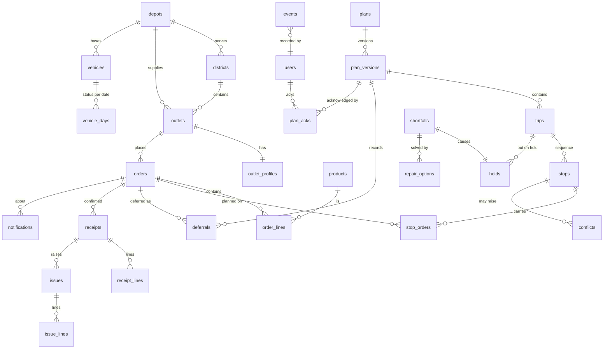

# 04 · Data model

PostgreSQL 16, managed by Alembic migrations in `services/api/alembic/`.
- **Naming:** `snake_case`, plural table names, `id` primary keys. Natural IDs from the dataset (`OUT001`, `VEH036`, `S1-001`) are kept as **unique business keys** alongside them.
- Reference tables are loaded from the dataset pack by the seed (see [09](09-seed-and-demo.md)).

## ER diagram

## Tables
### Reference (seeded from `datasets/`, read-only at runtime)
| Table | Key columns | Source |
|---|---|---|
| `depots` | `id`, `name` (Peliyagoda, Kandy) | derived from outlets |
| `districts` | `name` (PK), `depot`, `road_class`, `free_flow_kmh`, `depot_to_district_km`, `depot_to_district_freeflow_min`, `inter_stop_km`, `inter_stop_freeflow_min`, `is_dead_zone` | `district_travel.csv` (+ dead-zone flag: hill/rural) |
| `outlets` | `code` (OUT001), `brand`, `district`, `depot`, `dock_type`, `parking_constraint`, `mall_window_open/close`, `window_open/close` | `outlets.csv` |
| `vehicles` | `code` (VEH001), `type`, `temp`, `weight_cap_kg`, `volume_cap_m3`, `fuel_type`, `km_per_l`, `weekly_fuel_quota_l`, `depot` | `vehicles.csv` |
| `service_allowances` | (`brand`, `dock_type`) PK, `minutes` | `service_allowance.csv` |
| `calendar_days` | `date` PK, `dow`, `iso_year`, `iso_week`, `is_payday`, `festival`, `festival_ramp`, `is_holiday`, `monsoon`, `is_operating` | `calendar.csv` |
| `travel_ratios` | (`district`, `hour`) → `p50_ratio`, `p90_ratio` | **computed at seed** from `route_legs_train.csv` for the likely window (BR-18); not committed |

### Demo extras (our own fixtures, committed)
| Table | Columns |
|---|---|
| `outlet_profiles` | `outlet_id`, `split_rule` (`same_morning_only` · `any` · `never`), `language` (`si` · `ta` · `en`), `contact_name`, `access_note` |
| `products` | `id`, `name`, `brand`, `is_chilled`, `case_kg`, `case_m3` |
| `usual_quantities` | `outlet_id`, `product_id`, `usual_cases` |

### Operational
| Table | Key columns | Notes |
|---|---|---|
| `users` | `id`, `email` unique, `password_hash`, `name`, `role` (`dispatcher` · `loader` · `driver` · `store_manager`), `depot`, `dock`, `vehicle_id`, `outlet_id` | scope by role |
| `orders` | `id`, `ref` unique (S1-001), `outlet_id`, `brand`, `temp_requirement`, `delivery_date`, `units`, `weight_kg`, `volume_m3`, `deferred_yesterday`, `days_since_last_served`, `status`, `placed_at`, `source` (`dataset` · `app`) | the S1 rows are seeded from `task2b_peak_day_scenarios.csv` |
| `order_lines` | `id`, `order_id`, `product_id`, `qty_ordered`, `qty_loaded`, `qty_delivered`, `qty_received` | demo item lines; Σ cases = `orders.units` |
| `vehicle_days` | `vehicle_id`, `date`, `status` (`available` · `in_workshop`), `switched_on`, `off_reason`, `changed_by` | from `task2b_peak_day_fleet.csv`; BR-10 |
| `fuel_ledger` | `vehicle_id`, `iso_year`, `iso_week`, `litres_used` | BR-11 |
| `plans` | `id`, `depot`, `operating_date` unique per depot | |
| `plan_versions` | `id`, `plan_id`, `number`, `status` (`draft` · `published` · `superseded`), `created_by`, `published_at`, `solver_status`, `solve_ms`, `kpis` jsonb, `bottleneck` jsonb, `parent_version_id`, `change_reason` | **immutable once published** (DB trigger blocks updates) |
| `trips` | `id`, `version_id`, `vehicle_id`, `trip_no` (1·2), `brand`, `district`, `lane` (`predawn` · `daytime`), `planned_depart`, `plan_minutes`, `litres`, `locked` | |
| `stops` | `id`, `trip_id`, `seq`, `outlet_id`, `plan_arrival`, `likely_from`, `likely_to`, `at_risk`, `status` | two clocks (BR-18) |
| `stop_orders` | `stop_id`, `order_id`, `planned_cases`, `top_up_of_order_id` | top-ups (BR-30) |
| `deferrals` | `id`, `version_id`, `order_id`, `reason_code`, `group` (`unavoidable` · `choice`), `priority`, `displaces` jsonb, `next_run`, `confirmed_by`, `confirm_reason` | BR-15, BR-16, BR-21 |
| `plan_acks` | `version_id`, `user_id`, `acked_at` | BR-23, BR-31, BR-32 |
| `shortfalls` | `id`, `trip_id`, `order_id`, `kind` (`missing` · `damaged`), `qty`, `reason`, `photo_url`, `reported_by`, `event_time` | BR-26 |
| `holds` | `id`, `trip_id`, `shortfall_id`, `status` (`active` · `released`), `released_by_ack_id` | BR-27 |
| `repair_options` | `id`, `shortfall_id`, `label`, `rank`, `summary` jsonb, `breaks_store_rule`, `loss`, `applied` | BR-28, BR-29 |
| `events` | `event_id` uuid **PK** (client-generated), `type`, `actor_id`, `device_id`, `plan_version_id`, `entity_type`, `entity_id`, `payload` jsonb, `event_time`, `received_at` | **append-only** (trigger forbids UPDATE/DELETE); BR-35 to BR-37 |
| `receipts` | `id`, `order_id`, `confirmed_by`, `confirmed_at` | BR-46 |
| `receipt_lines` | `receipt_id`, `order_line_id`, `driver_qty`, `store_qty` | |
| `issues` | `id`, `order_id`, `kind` (`store_report` · `count_conflict` · `stale_plan`), `status` (`open` · `resolved`), `resolution` (`redeliver` · `credit` · `reject` · `driver_stands` · `store_stands` · `recount`), `note`, `resolved_by` | BR-51 to BR-53 |
| `issue_lines` | `issue_id`, `order_line_id`, `problem` (`missing` · `damaged` · `wrong_item` · `warm`), `qty`, `photo_url` | BR-47 |
| `driver_notes` | `outlet_id`, `date`, `text`, `sent_at` | BR-39 |
| `notifications` | `id`, `recipient_user_id`, `outlet_id`, `kind` (`deferral` · `eta_late` · `decision`), `reason_code`, `lang`, `body`, `acked_at` | BR-44, BR-49 |
| `exceptions` | `id`, `kind`, `impact`, `entity_ref`, `suggested_fix` jsonb, `status` | BR-48 |
| `clock_settings` | singleton: `demo_now` (nullable), `set_by`, `set_at` | BR-56 |

## Integrity rules in the database
- Unique `orders.ref`, `outlets.code`, `vehicles.code`, `(plan_id, number)`, and `events.event_id`.
- CHECK `trips.trip_no IN (1, 2)`. Unique `(version_id, vehicle_id, trip_no)`.
- Triggers block UPDATE/DELETE on `events`, and UPDATE on published `plan_versions` (and their trips and stops).
- All FKs are `ON DELETE RESTRICT` (nothing cascades away history).
