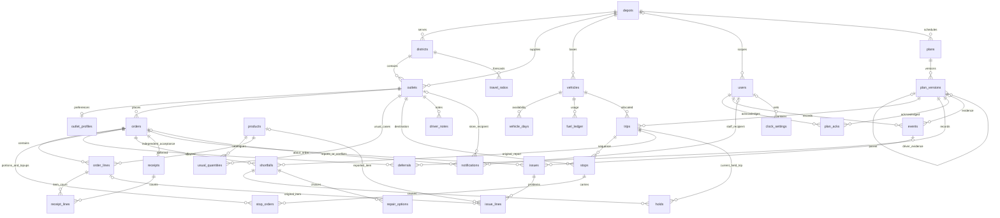

# 04 · Data model

PostgreSQL 16 is managed by `services/api/alembic/`. This documents the merged ORM
and migrations, including store receipts, sync conflicts and dispatcher repairs.
No new migration is required for the CP-SAT demo fixes.

Reference tables use natural primary keys: depot/district `name`, outlet/vehicle
`code`, and calendar `date`. Operational entities generally use UUID `id`; orders
also have a unique `ref`. Composite keys are listed below. Competition data and
its derived travel ratios are loaded locally and are never committed.

## ER diagram

Exceptions use a polymorphic `entity_type`/`entity_id`, not a foreign key to one
specific entity. Count conflicts and stale-plan conflicts are `issues` rows;
there is no separate `conflicts` table and no receipt-to-issue foreign key.

## Tables and actual keys

### Reference and demo catalogue

| Table | Key and important columns |
|---|---|
| `depots` | `name` PK |
| `districts` | `name` PK; `depot`, `road_class`, `free_flow_kmh`, `depot_to_district_km`, `depot_to_district_min`, `inter_stop_km`, `inter_stop_min`, `is_dead_zone` |
| `outlets` | `code` PK; `brand`, `district`, `depot`, `dock_type`, `parking_constraint`, `mall_window_open`, `mall_window_close`, `window_open`, `window_close` |
| `vehicles` | `code` PK; `type`, `temp`, `weight_cap_kg`, `volume_cap_m3`, `fuel_type`, `km_per_l`, `weekly_fuel_quota_l`, `depot` |
| `service_allowances` | (`brand`, `dock_type`) PK; integer `minutes` |
| `calendar_days` | `date` PK; `dow`, `iso_year`, `iso_week`, `is_payday`, `festival`, `festival_ramp`, `is_holiday`, `monsoon`, `is_operating` |
| `travel_ratios` | (`district`, `hour`) PK; `p50_ratio`, `p90_ratio`, computed at seed time |
| `outlet_profiles` | `outlet_code` PK/FK; `split_rule` (`same_morning_only`, `any`, `never`), `language`, `contact_name`, `access_note` |
| `products` | string `id` PK; `name`, `brand`, `is_chilled`. Demo case dimensions live in seed configuration, not product DB columns |
| `usual_quantities` | (`outlet_code`, `product_id`) PK; `usual_cases` |

### Accounts, orders and fleet

| Table | Key and important columns |
|---|---|
| `users` | UUID `id`; unique `email`, `password_hash`, `name`, `role`, nullable `depot`, `dock`, `vehicle_code`, `outlet_code` scopes |
| `orders` | UUID `id`; unique `ref`, `outlet_code`, `brand`, `temp_requirement`, `delivery_date`, `units`, `weight_kg`, `volume_m3`, `deferred_yesterday`, `days_since_last_served`, `status`, `source`, `placed_at`, `placed_by` |
| `order_lines` | UUID `id`; `order_id`, `product_id`, `qty_ordered`, nullable `qty_loaded`, `qty_delivered`, `qty_received` |
| `driver_notes` | UUID `id`; `outlet_code`, `for_date`, `text`, `sent_at`, `sent_by` |
| `vehicle_days` | (`vehicle_code`, `date`) PK; `status`, `switched_on`, `off_reason`, `changed_by`, `changed_at` |
| `fuel_ledger` | (`vehicle_code`, `iso_year`, `iso_week`) PK; `litres_used` |

### Planning, loading and repair

| Table | Key and important columns |
|---|---|
| `plans` | UUID `id`; unique (`depot`, `operating_date`) |
| `plan_versions` | UUID `id`; unique (`plan_id`, `number`), `status`, `parent_version_id`, `change_reason`, `created_by`, `created_at`, `published_at`, `solver_status`, `solve_ms`, JSON `kpis`, `bottleneck` |
| `trips` | UUID `id`; unique (`version_id`, `vehicle_code`, `trip_no`), `brand`, `district`, `lane`, `planned_depart`, integer `plan_minutes`, `litres`, `weight_kg`, `volume_m3`, `locked` |
| `stops` | UUID `id`; unique (`trip_id`, `seq`), `outlet_code`, `plan_arrival`, `likely_from`, `likely_to`, `at_risk`, operational `status` |
| `stop_orders` | (`stop_id`, `order_id`) PK; `planned_cases`, nullable `top_up_of_order_id` FK to `orders.id` |
| `deferrals` | UUID `id`; unique (`version_id`, `order_id`), `reason_code`, `group`, `priority`, JSON `displaces`, `explanation`, `next_run`, `confirmed_by`, `confirmed_at`, `confirm_reason` |
| `plan_acks` | (`version_id`, `user_id`) PK; `acked_at` |
| `shortfalls` | UUID `id`; original `trip_id`, `order_id`, `kind`, `qty`, `reason`, `photo_url`, `reported_by`, `event_time` |
| `holds` | UUID `id`; current `trip_id`, `shortfall_id`, `status`, `created_at`, `released_at`, `released_by` user FK |
| `repair_options` | UUID `id`; `shortfall_id`, `label`, `rank`, `title`, JSON `summary`, `breaks_store_rule`, `loss`, `recommended`, `applied_at`, `applied_by` |

A repair creates a child plan version and new trip/stop IDs. Published v1 stays
readable; the highest-numbered published version is the current read projection.
`shortfalls.trip_id` preserves the original report's provenance, while active
`holds.trip_id` moves to the corresponding v2 trip. A linked 2-case top-up is a
separate `stop_orders` portion with `top_up_of_order_id` pointing to the original
order; it does not change the original order's total cases.

### Evidence, store receipts and operations

| Table | Key and important columns |
|---|---|
| `events` | client UUID `event_id` PK; `type`, `actor_id`, `device_id`, nullable `plan_version_id`, `entity_type`, `entity_id`, JSON `payload`, `event_time`, `received_at` |
| `receipts` | UUID `id`; unique `order_id`, `confirmed_by`, `confirmed_at`, `total_cases` |
| `receipt_lines` | (`receipt_id`, `order_line_id`) PK; `driver_qty`, `store_qty` |
| `issues` | UUID `id`; `order_id`, `kind` (`store_report`, `count_conflict`, `stale_plan`), `status`, nullable `driver_event_id`, `driver_qty`, `store_qty`, `store_photo_url`, `opened_at`, `resolution`, `note`, `resolved_by`, `resolved_at` |
| `issue_lines` | UUID `id`; `issue_id`, nullable `order_line_id` and `product_id`, `problem`, `qty`, `photo_url` |
| `notifications` | UUID `id`; nullable `outlet_code`, `recipient_user_id`, `order_id`; `kind`, `reason_code`, `lang`, `title`, `body`, JSON `data`, `created_at`, `acked_at` |
| `exceptions` | UUID `id`; `kind`, `impact`, `title`, `detail`, `entity_type`, `entity_id`, JSON `suggested_fix`, `status`, `created_at` |
| `clock_settings` | singleton integer `id` (1); nullable `demo_now`, `set_at`, `set_by` |

A store receipt is independent evidence from the driver's event. Reconciliation
records a decision and retains both counts and their timestamps. Exception and
notification rows are projections for the relevant role. The device's outbox is
IndexedDB in the PWA, not another PostgreSQL table.

## Database integrity and boundaries

- Unique keys prevent duplicate orders, plan version numbers and trip slots;
  `trips.trip_no` is checked to be 1 or 2.
- PostgreSQL triggers reject all event UPDATE/DELETE. The event payload and device
  event time remain evidence; mutable projections carry the current state.
- Published/superseded trip allocation rows reject INSERT/UPDATE/DELETE. Published
  stop rows allow only a `status` update. Version guards protect plan ID, number,
  KPIs and publication time and prohibit returning to draft. The trigger is not
  a blanket ban on every metadata field or a trigger on `stop_orders`; application
  services also preserve published quantities by creating child versions.
- Foreign keys have no cascading history deletes; they use the database's default
  no-action semantics rather than explicit ON DELETE RESTRICT everywhere.
- Timestamp timezone handling uses the Clock and UTC storage; screens show
  Asia/Colombo. Standard plan minutes and likely-arrival windows are separate.
- Engine/API tests use synthetic SQLite fixtures. PostgreSQL-specific trigger
  enforcement must be checked against the deployed database, not inferred from
  those SQLite tests.
